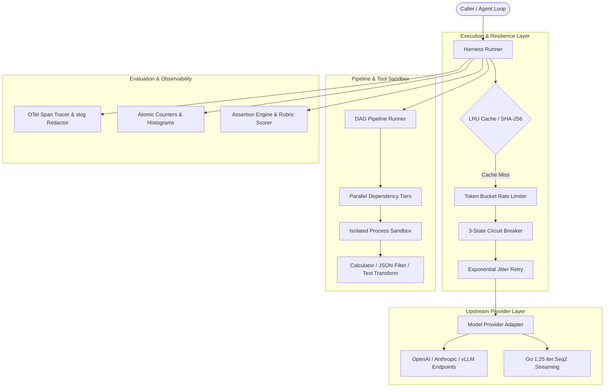

# ai-harness

[](https://github.com/thanhauco/ai-harness/actions/workflows/ci.yml)
[](https://goreportcard.com/report/github.com/thanhauco/ai-harness)
[](LICENSE)
[](https://golang.org)

**ai-harness** is a high-throughput, resilient execution harness and evaluation runtime for AI workloads and agentic pipelines built with Go 1.25.

Unlike prompt wrappers or superficial toy frameworks, `ai-harness` is engineered from first principles as production infrastructure: featuring 3-state adaptive circuit breaking, atomic token-bucket rate limiters, full-jitter exponential backoff, a DAG pipeline orchestrator with parallel Kahn topological sorting, safe sandboxed tool execution, OpenTelemetry-compatible tracing, and a quantitative evaluation benchmark suite.

---

## Architecture Overview



---

## Key Features

1. **Modern Go 1.25 Primitives**:
   - Native `iter.Seq2[StreamChunk, error]` streaming token iterators.
   - Standard library `log/slog` wrapping with automated regex PII and secret key masking.
   - Zero external runtime dependencies; builds in milliseconds.

2. **Fault Tolerance & Resilience**:
   - **Adaptive Circuit Breaker**: Closed, Open, and Half-Open state machine with automatic failure cooldown.
   - **Token Bucket Rate Limiter**: Non-blocking `Allow()` and context-cancellation-aware `Wait()`.
   - **Full Jitter Exponential Backoff**: Prevents thundering herd on upstream rate limits.

3. **DAG Pipeline Engine**:
   - Kahn's topological sort algorithm automatically divides complex workflows into parallel execution tiers.
   - Step lifecycle hooks (`BeforeStep`, `AfterStep`), conditional skipping, and shared thread-safe `ExecutionState`.

4. **Isolated Process Sandbox**:
   - Executes external tools and commands with CPU time bounds, stdout/stderr byte limits, and whitelist policies.
   - Parameter schema validation checking required fields, data types, and enum restrictions.

5. **Automated Evaluation Benchmark Suite**:
   - Assertions: `ExactMatch`, `Contains`, `NotContains`, `RegexMatch`, `JSONSchemaValid`, `LatencyBudget`, and `TokenLimit`.
   - Weighted multi-criteria Rubrics with normalized scoring.
   - Concurrent test runner calculating P50, P90, P99 latency percentiles and generating Markdown summary tables.

---

## Installation & Quickstart

### Build Binary
```bash
make build
./bin/aih version
```

### CLI Commands

```bash
# 1. Execute a prompt through the resilient runner
./bin/aih run --prompt "Summarize distributed consensus algorithms"

# 2. Run the automated evaluation suite
./bin/aih eval

# 3. Benchmark harness throughput (e.g. 2000 requests, 32 workers)
./bin/aih bench -n 2000 -c 32
```

---

## Programmatic Usage

### 1. Resilient Model Calling

```go
package main

import (
    "context"
    "fmt"
    "time"

    "github.com/thanhauco/ai-harness/pkg/harness"
    "github.com/thanhauco/ai-harness/pkg/provider"
    "github.com/thanhauco/ai-harness/pkg/resilience"
    "github.com/thanhauco/ai-harness/pkg/storage"
)

func main() {
    p := provider.NewMockProvider("gpt-4o", "Consistent production response.")

    runner := harness.NewRunner(harness.RunnerConfig{
        Provider: p,
        Policy: &resilience.Policy{
            Limiter: resilience.NewTokenBucket(100, 20),
            Breaker: resilience.NewCircuitBreaker(resilience.CircuitBreakerConfig{
                FailureThreshold: 5,
                RecoveryTimeout:  10 * time.Second,
            }),
            Retry: resilience.DefaultRetryConfig(),
        },
        Cache: storage.NewLRUCache(1000, time.Hour),
    })

    resp, err := runner.ExecutePrompt(context.Background(), harness.NewPrompt(harness.NewUserMessage("Hello")))
    if err != nil {
        panic(err)
    }

    fmt.Printf("Response: %s (Tokens: %d, Cached: %v)\n", resp.Content, resp.Usage.TotalTokens, resp.Cached)
}
```

### 2. DAG Workflow Pipeline

```go
dag, err := harness.NewPipelineBuilder().
    Step("extract", "Extract Raw Data", extractFn).
    Step("summarize", "Summarize Extracted Data", summarizeFn, "extract").
    Step("audit", "Run Security Audit", auditFn, "extract").
    Step("publish", "Publish Verified Report", publishFn, "summarize", "audit").
    Build()

summary, err := dag.Execute(context.Background(), harness.NewExecutionState(), 4)
```

---

## Testing & Quality Assurance

```bash
# Run unit tests
make test

# Run tests with the Go race detector
make race

# Run benchmarks
make bench
```

---

## License

Released under the [MIT License](LICENSE). Copyright (c) 2026 thanhauco.
